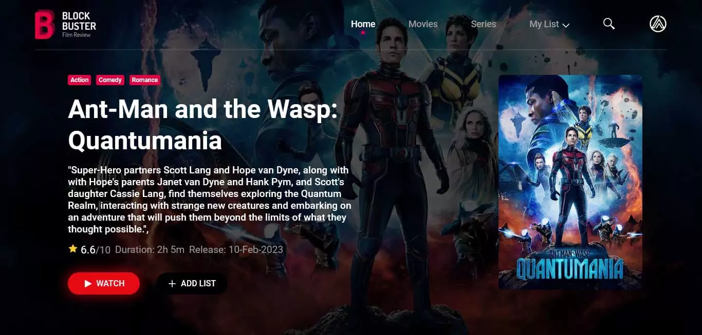

<div align="center">

# 🎬 Blockbuster — Film Review

**A Netflix-styled movie & TV discovery app, built with Next.js, TypeScript, Redux, and the TMDB API.**

[](https://nextjs.org)
[](https://www.typescriptlang.org)
[](https://tailwindcss.com)
[](https://redux-toolkit.js.org)
[](https://www.framer.com/motion)
[](./LICENSE)

<!-- Swap in your real deployment + banner once they exist -->
[Live Demo](https://th-blockbuster.vercel.app) · [Report a Bug](https://github.com/Tanveer-G/blockbuster/issues) · [Request a Feature](https://github.com/Tanveer-G/blockbuster/issues)



</div>

---

## About the Project

**Blockbuster** is a movie & TV discovery front end inspired by Netflix's visual
language — black/red/pink/yellow palette, poster carousels, and a details page built
around a cinematic backdrop hero. It's built as a showcase of **production-quality
Next.js + TypeScript architecture**: strict typing throughout, a typed Redux store,
a design system carried over faithfully in Tailwind, and interaction details (hover
quick-views, drag-to-scroll carousels, animated drawers) that go beyond a typical
demo app.

It ships with bundled TMDB fixture data out of the box, so it runs and looks fully
populated with zero configuration — while staying one `fetchDataFromApi<T>()` call
away from live data once a TMDB token is added.

---

## ✨ Features

- **Rich media cards** — media-type badge, rating badge, and a desktop hover
  quick-view panel (overview snippet + genre chips resolved from `genre_ids`),
  animated with Framer Motion. Heart/watched toggles have tap micro-animations;
  `CastCard` lifts and glows on hover.
- **Swiper-powered carousels** — precise per-breakpoint `slidesPerView`, free-mode
  momentum scrolling, mouse-wheel support, and grab-to-drag. Feels smooth on touch,
  trackpad, and mouse alike. Prev/next arrows only render on desktop.
- **DOM-level responsive rendering** — a `useMediaQuery` / `useBreakpoint` hook
  decides whether a subtree mounts *at all*, instead of shipping both variants into
  the DOM and toggling visibility with `hidden md:block`. Used by the header nav,
  bottom nav, mobile drawer, and carousel arrows.
- **Animated mobile navigation** — a right-side drawer with backdrop blur, an
  animated hamburger-to-X icon, staggered link entrance, Escape/backdrop/link-click
  dismissal, and scroll locking — driven by a small Redux `uiSlice`.
- **Dynamic backgrounds** — the page background crossfades to match context: default
  on browse pages, and the selected title's backdrop on its details page.
- **Scroll-triggered section entrances** and a fully working, animated home search bar.

---

## 🛠 Tech Stack

| Layer | Choice |
|---|---|
| Framework | [Next.js 16](https://nextjs.org) (App Router, Server Components) |
| Language | [TypeScript](https://www.typescriptlang.org) — `strict`, `noUncheckedIndexedAccess` |
| Styling | [Tailwind CSS](https://tailwindcss.com) |
| State | [Redux Toolkit](https://redux-toolkit.js.org) |
| Animation | [Framer Motion](https://www.framer.com/motion) |
| Carousels | [Swiper](https://swiperjs.com/react) |
| Data | [TMDB API](https://www.themoviedb.org/documentation/api) (bundled fixtures by default) |
| HTTP | Axios (`src/lib/tmdbApi.ts`) |

---

## 📁 Project Structure

```
src/
  app/                          Routes (App Router), each a typed Server Component
    page.tsx                    "/"
    movies/page.tsx             "/movies"
    series/page.tsx             "/series"
    search/[query]/page.tsx     "/search/:query"
    [mediaType]/[id]/page.tsx   "/:mediaType/:id" (Details page)
    not-found.tsx                Custom 404
    layout.tsx                   Root layout
    globals.css                  Tailwind + theme tokens

  components/
    layout/common/                Shared chrome
      Background.tsx              Full-bleed backdrop image + crossfade
      GlobalBackground.tsx        Reads Redux's home.backgroundImage
      BackgroundSync.tsx          Pages use it to set the background image
      HeaderTop.tsx                Top nav: desktop links or hamburger button
      NavigatorBottom.tsx          Fixed bottom nav — mobile only
      MobileDrawer.tsx             Right-side slide-in nav drawer — mobile only
    Card.tsx                     Movie/show card + CastCard + PersonProfileCard
    CarouselRow.tsx               Shared Swiper wrapper
    Carousel.tsx / PersonCarousel.tsx / VideosCarousel.tsx
    Section.tsx                  Heading + scroll-triggered fade-in wrapper
    Genres.tsx, Filter.tsx, Tabs.tsx, Switch.tsx, TrendQuery.tsx,
    Discover.tsx, Trending.tsx, Hero.tsx, WelcomeSearch.tsx
    UI/ArrowAnimation.tsx        CSS-module bounce arrow

  redux/
    store.ts                     configureStore + RootState/AppDispatch types
    hooks.ts                     useAppDispatch / useAppSelector (typed)
    features/homeSlice.ts        imgUrl, genre lists, backgroundImage
    features/uiSlice.ts          isMobileMenuOpen (drives MobileDrawer)
    ReduxProvider.tsx, AppInit.tsx

  lib/
    tmdbApi.ts                   Generic, typed axios wrapper: fetchDataFromApi<T>()
    endPoints.ts                 TMDB endpoint builders
    findMedia.ts                 Looks a clicked card up across bundled datasets

  hooks/
    useFetchApi.ts               Generic client-side fetch hook: useFetchApi<T>()
    useMediaQuery.ts              useMediaQuery() + useBreakpoint()

  types/tmdb.ts                  Genre, MediaSummary, MediaDetails, Credits, Video,
                                  PaginatedResponse<T>, SearchResultItem, ImageConfig...

  data/                          Bundled demo/fixture JSON, typed against types/tmdb.ts

public/images/                   Image assets, incl. backGroundImage.jpg (default bg)
```

---

## 🎯 Design & Data Notes

- **Per-title details page** — the bundled fixtures ship one fully-detailed title.
  `src/app/[mediaType]/[id]/page.tsx` looks the clicked card up across every bundled
  list (popular, trending, top rated, recommended, similar, search) via
  `src/lib/findMedia.ts`, and uses that match's title/poster/backdrop/rating/year for
  the hero and background. Deeper fields (overview, cast, runtime, videos,
  similar/recommendations) come from the one demo fixture — swap `findMediaSummary`
  for `fetchDataFromApi<MediaDetails>()` once a real lookup is wired up.
- **Typing third-party JSON** — rather than a 1:1 interface for TMDB's full response
  shape (or leaving fixtures as loose `any`), each fixture asserts its shape against
  the slim interfaces in `src/types/tmdb.ts` via `as unknown as MediaDetails`. Every
  consumer gets full IntelliSense and type safety without the fixtures needing
  hundreds of unused fields.
- **Touch vs. hover** — the card quick-view panel is hover-driven (desktop/trackpad);
  touch devices tap straight through to the details page.
- **Design fidelity** — the black/red/pink/yellow palette and overall layout were
  carried over faithfully in Tailwind utility classes, rather than a pixel-identical
  CSS port.

---

## 🚀 Getting Started

### Prerequisites
- Node.js 18+
- npm (or your package manager of choice)

### Installation

```bash
git clone https://github.com/Tanveer-G/blockbuster.git
cd blockbuster
npm install
```

### Environment variables

The app runs out of the box on bundled fixture data. To point it at live TMDB data
(used today for image-config + genre lists in `src/redux/AppInit.tsx`), copy
`.env.example` to `.env.local` and add your token:

```bash
NEXT_PUBLIC_TMDB_TOKEN=your_tmdb_v4_read_access_token
```

Get one from [TMDB → Settings → API](https://www.themoviedb.org/settings/api).

### Run it

```bash
npm run dev
```

Open [http://localhost:3000](http://localhost:3000).

### Verify

```bash
npm run typecheck   # tsc --noEmit — zero errors
npm run lint         # zero errors
npm run build        # production build
```

All routes (`/`, `/movies`, `/series`, `/search/[query]`, `/[mediaType]/[id]` for both
`movie` and `tv`, and the 404 page) are smoke-tested against a production build.

---

## 🗺 Roadmap

- [ ] Wire the Details/Search pages to live TMDB data by default
- [ ] User accounts + a real watchlist (beyond local fixture state)
- [ ] Season/episode browsing for TV shows
- [ ] E2E tests (Playwright)

Have an idea? [Open an issue](https://github.com/Tanveer-G/th-blockbuster/issues).

---

## 👤 Author

**Tanveer** — Full Stack Engineer & Product-Minded Designer

Building with React, Next.js, and TypeScript. Background spans AI-generated
advertising video tooling and custom CRM dashboard development.

- GitHub: [@Tanveer-G](https://github.com/Tanveer-G/)
- Portfolio: [@Tanveer-G](https://tanveer-portfolio.vercel.app/)
- LinkedIn: [@tanveer-h1](https://www.linkedin.com/in/tanveer-h1/)

If this project helped you or you like what you see, consider ⭐️ starring the repo!

---

## 📄 License

Distributed under the MIT License. See [`LICENSE`](./LICENSE) for details.

This product uses the TMDB API but is not endorsed or certified by TMDB.